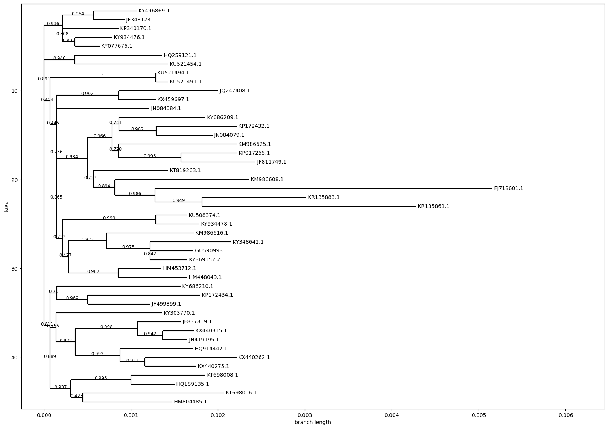
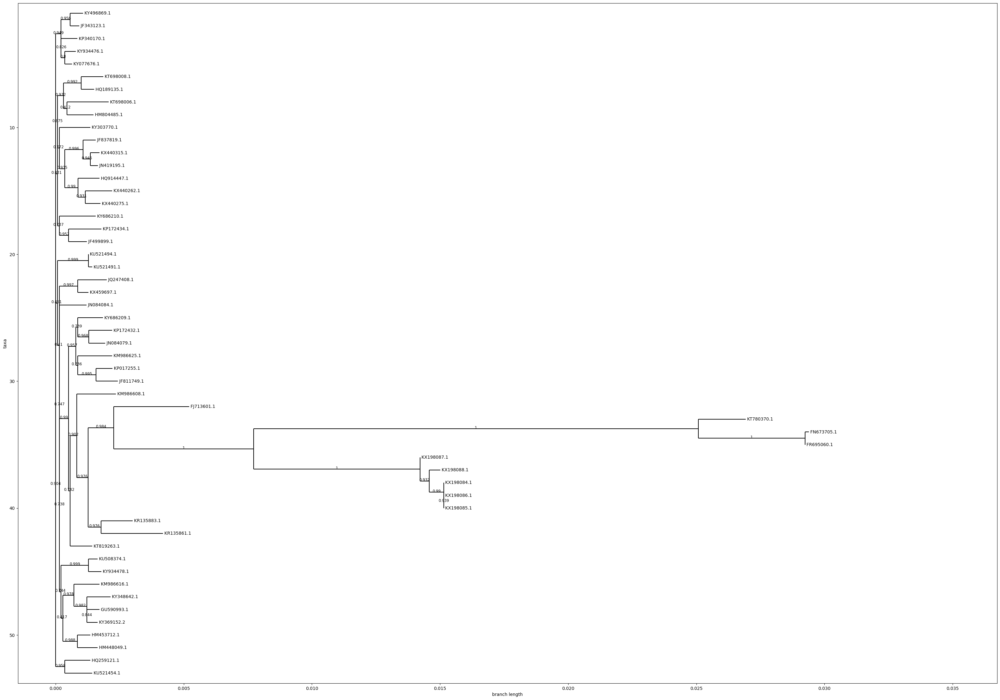
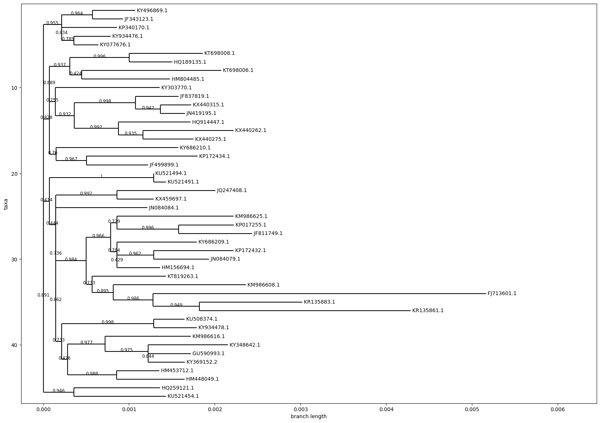
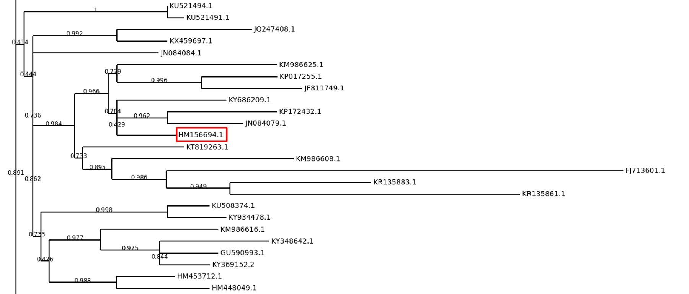

# How humans populated the Earth 
## 1. Construct an evolutionary tree based on human mtDNA data
I combined all the fasta files into one using the command:
```
cat *.fasta > combined_sequences.fasta
```
Next, I annotated it using MAFFT:
```
mafft combined_sequences.fasta > aligned_sequences.fasta
```
I built the tree using FastTree:
```
FastTree -gtr -nt -boot 1000 aligned_sequences.fasta > tree_with_bootstrap.nwk
```
Since things didn't work out with R, I visualized the tree in Python using Biopython and Matplotlib in the script tree_with_bootstrap_mtdna_draw.ipynb (located in the Code folder, along with all further, practically identical scripts for tree visualization).
The resulting tree:



From the tree, it's clear that the longest branch is FJ713601.1, a human code from haplogroup L1c1d, Central African.
We conclude that Eve originated from Africa (Yes, this is a discovery!).

## 2. Use the multiple alignment you constructed and estimate how old Mitochondrial Eve is. How old is the most recent ancestor of all non-Africans?

We will determine the approximate age of Eve using the script Eve_age.ipynb (located in the Code folder), which calculates the number of mutations between haplogroup L1c1d and the other haplogroups, selects the highest value from the results, and multiplies it by the average rate of mitochondrial mutations.
Determining the average rate of mitochondrial mutations is not easy, even with sources — the data varies depending on the method and source — ranging from 1,000 to 15,000 years per mutation. Moreover, the method for calculating Eve's age should be more complex than just multiplying two numbers — mutations in mitochondria occur at different rates depending on the location in the genome (coding/non-coding regions, etc.). However, I decided not to complicate it and took the average from all sources — 3,000 years per mutation. The obtained data is close to reality:

| Metric                              | Value          |
|-------------------------------------|----------------|
| Maximum number of mutations          | 96             |
| Estimated age of Mitochondrial Eve  | 192,000 years  |


## 3. Add five Neanderthal samples and three Denisovan samples to the set of Homo sapiens samples and construct the resulting evolutionary tree. What is the age of the most recent Neanderthal-modern human ancestor?

By adding new fasta files to the Human folder, we will repeat all the actions from point 1 and obtain the following tree:



From the tree, it can be seen that the most recent Neanderthal in the dataset is KX198087.1 (GoyetQ305-4 Neanderthal).
Repeating the actions from point 2, but with the script Neanderthal_age.ipynb (located in the Code folder) for KX198087.1, we obtain the following data, which is also close to reality:

| Metric                              | Value          |
|-------------------------------------|----------------|
| Maximum number of mutations          | 213            |
| Estimated age of the most recent Neanderthal | 426,000 years  |

## 4. Place the particular human sample on the obtained tree.

Taking mitochondrial genome data from a random person from GeneBank (HM156694.1), we will repeat the actions from point 1 and obtain the following tree:





From it, it is clear that the person belongs to the same haplogroup as KY686209.1 (M60), KP172432.1 (D1) and JN084079.1 (D4e1a1). Presumably, this person belongs to the D-haplogroup.

##Human Population Expansion

Based on the phylogenetic analyses and genetic data, it is evident that human populations have undergone significant migrations and expansions over the millennia. The age estimates of Mitochondrial Eve, ranging from 100,000 to 200,000 years, suggest that our common maternal ancestor lived during a period when modern humans were beginning to migrate out of Africa.

Fossil evidence, such as the Omo remains in Kenya, supports the timeline of early human existence in Africa. As humans spread out, they encountered and interacted with other hominin species like Neanderthals and Denisovans. Genetic data indicate that interbreeding events occurred, contributing to the genetic diversity seen in modern non-African populations today.

Geographically, early humans likely followed water sources and utilized land bridges, such as those that existed during glacial periods, to migrate to new territories. The evidence of distinct haplogroups and genetic markers in various regions illustrates the complex pathways of human migration, influenced by environmental factors, resource availability, and social interactions.

In summary, the journey of humans populating the Earth is marked by a series of migrations, interactions with other species, and adaptations to diverse environments, which have shaped our genetic legacy and cultural diversity.
